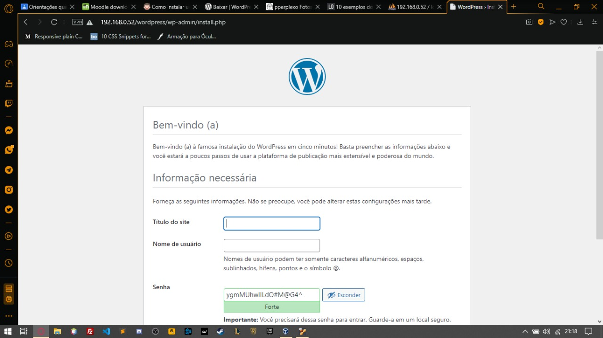
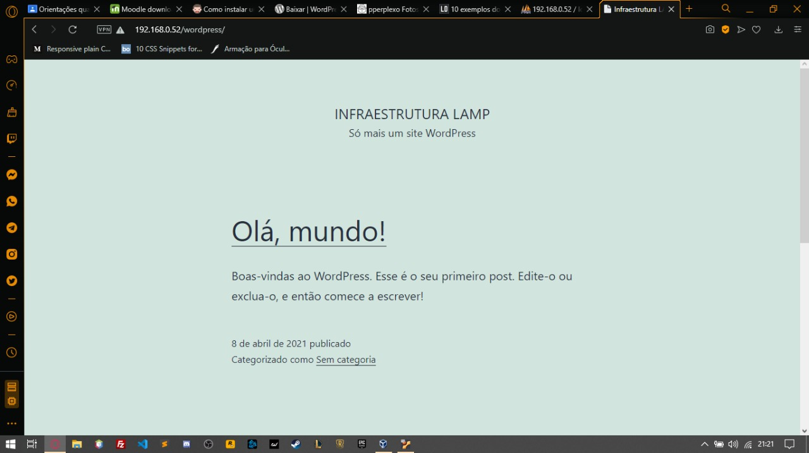
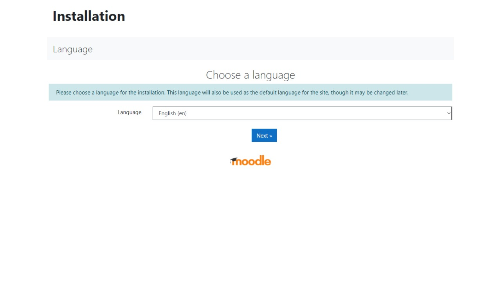
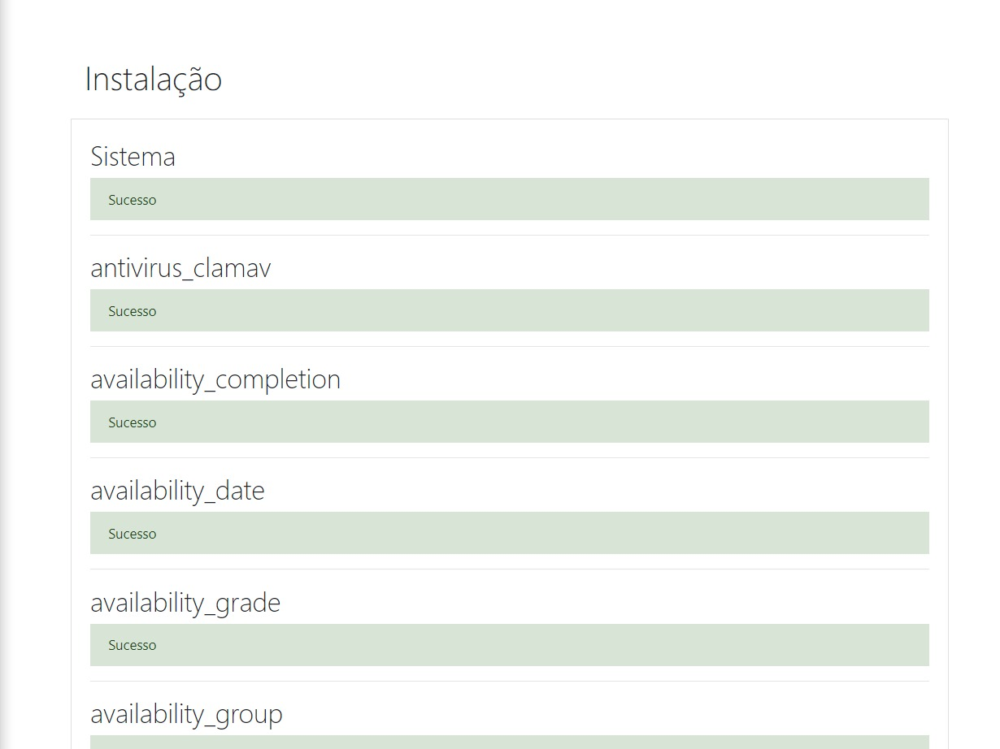
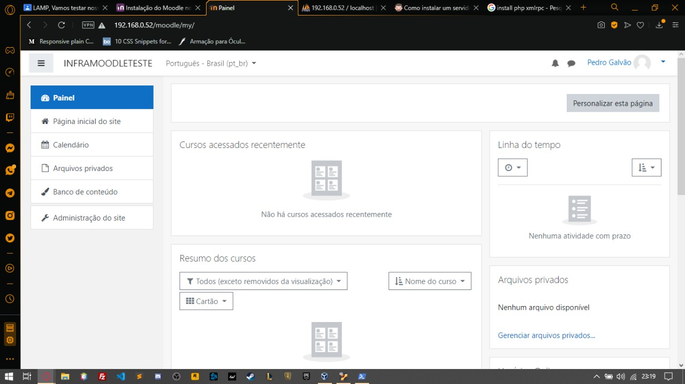

# infra-word-e-moodle
Projeto que demostra a instalação e utilização inicial do **CMS WordPress** e do **AVA Moodle**.<br/>
:warning: **Todos os procedimentos foram feitos em uma infraestrutura LAMP(Linux, Apache, MySQL e PHP) completamente funcional e em usuário root**
# Instalando o WordPress :pencil:
Comece Baixando o instalador tar.gz do WordPress
```bash
$ wget https://br.wordpress.org/latest-pt_BR.tar.gz
```
Aguarde o Download terminar de preferência que seja feito este comando na pasta root do Apache no meu caso **home/user/www** feito o download rode o comando:
```bash
$ tar -xvf latest-pt_BR.tar.gz
```
Dentro da pasta wordpress, renomeie o arquivo wp-config-sample.php para wp-config.php
```bash
$ mv wp-config-sample.php wp-config.php
```
Abra-o no editor de textos Nano
```bash
$ nano wp-config.php
```
E altere nome e senha do banco de dados, banco de dados este que deve ser criado no PhpMyAdmin com a base de dados nomeada como **wordpress**<br/>
Reinicie o Apache
```bash
$ /etc/init.d/apache2 restart
```
Feito isso acesse **localhost/wordpress** onde irá aparecer uma tela como a imagem abaixo, preencha os campos e clique Finalizar

Pronto! Você já possui seu primeiro site e ambiente Wordpress para trabalhar.

# Instalando o Moodle :pencil:
Para esse iremos precisar do navegador de terminal links
```bash
$ apt-get install links
```
Vamos começar baixando o nosso instalador tar.gz
```bash
$ links https://download.moodle.org/download.php/direct/stable310/moodle-3.10.3.tgz
```
Feito isso vamos descompactar em nossa pasta root do apache
```bash
$ tar -xvf moodle-3.10.3.tgz
```
Agora acesse o site **localhost/moodle** você verá a primeira tela do MOODLE, selecione a linguagem adequada para a instalação: Português – Brasil<br/>
Clique no botão **Next**

O moodle irá fazer uma verificação no sistema e mostrará uma tela que serve para definir se o sistema é capaz de “rodar” o moodle ou não<br/>
Se todos os itens estiverem OK clique no botão Próximo<br/>
A próxima tela irá mostrar o endereço que será usado para acessar o moodle<br/>
Caso o endereço seja diferente é necessário alterá-lo no campo endereço web<br/>
O moodle também mostra nesta tela o diretório onde será instalado que no meu caso é o diretório **/home/user/www/moodle**<br/>
Crie o Diretório usando o comando 
```bash
$ mkdir /home/user/moodledata
```
É necessário também conceder ao diretório moodledata todos os privilégios de acesso usando o comando 
```bash
$ chmod 777 moodledata
```
Restart o apache 
```bash
$ /etc/init.d/apache2 restart
```
Atualize esta página da Web (F5)<br/>
E clique no botão **Próximo**<br/>
A próxima tela é muito importante pois se refere ao banco de dados do moodle, vamos aprender como criar a base de dados usando o programa **phpMyAdmin**<br/>
Abra outra janela do seu navegador padrão e digite **localhost/phpmyadmin**<br/>
Se pedir usuário e senha, coloque os dados do root<br/>
Na janela principal do phpMyAdmin digite no campo Criar novo banco de Dados a palavra **moodle** e clique no botão **Criar**<br/>
O Banco de dados então será criado...<br/>

Volte a tela principal do phpMyAdmin e clique na opção **Privilégios**<br/>
Clique no botão **Adicionar novo usuário**<br/>

Na próxima tela devemos informar o nome do usuário, o Servidor onde será utilizado e também a Senha<br/>
**Nome do Usuário: moodle<br/>
Servidor: localhost<br/>
Senha: moodle**<br/>

No item **Privilégios globais** vamos clicar na opção **Marcar todos**<br/>
Para concluir a criação do usuário vamos clicar no botão **Executar**<br/>
Pronto! O usuário moodle foi criado com sucesso<br/>
Voltemos então para a instalação do moodle<br/>

Na tela de configuração do banco de dados devemos informar:<br/>
**Tipo do banco de dados: MySQL<br/>
Servidor hospedeiro do banco de dados: localhost<br/>
Base de dados: moodle<br/>
Usuário do banco: moodle<br/>
Senha do banco: moodle**<br/>
Para continuar a instalação clique no botão **Próximo**<br/>
O moodle fará outra verredura no sistema para verificar se o ambiente é compatível ou não<br/>

**Antes de continuar, vamos executar alguns passos:**<br/>
Entre no diretório cd **/home/user/www/moodle**<br/>
Digite o comando
```bash
$ cp config-dist.php config.php
``` 
Digite o comando
```bash
$ chmod 777 config.php
``` 
Edite o arquivo config.php
```bash
$ nano config.php
``` 
Que esta no diretório **/home/user/www/moodle**<br/>
Verifique as seguintes linhas:<br/>
**$CFG->dbtype = 'mysqli'; // mysql or postgres7 (for now)<br/>
$CFG->dbhost = 'localhost'; // eg localhost or db.isp.com<br/>
$CFG->dbname = 'moodle'; // database name, eg moodle<br/>
$CFG->dbuser = 'moodle'; // your database username<br/>
$CFG->dbpass = 'moodle'; // your database password<br/>
$CFG->prefix = 'mdl_'; // Prefix to use for all table names<br/>
Verifique a linha $CFG->wwwroot = 'http://localhost/moodle';<br/>
Verifique a linha $CFG->dirroot = '/home/user/www/moodle';<br/>
Verifique a linha $CFG->dataroot = '/home/user/moodledata';**<br/>
Elas devem estar exatamente deste jeito<br/>
Salve e feche o arquivo config.php

Volte a instalação do moodle e clique em **Continuar Instalação**<br/>
Na Próxima tela você poderá selecionar o pacote de idiomas mais adequado, em nosso caso vamos clicar em Baixar o pacote de idioma “Português – Brasil (pt_br)”<br/>
Para continuar a instalação clique no botão **Próximo**

Neste momento o moodle vai tentar confirmar a criação do arquivo c**onfig.php** em **/home/user/www/moodle**, por isso esse diretório deve ter privilégios de leitura e gravação<br/>
Caso ocorra algum erro durante esse processo, confirme novamente as configuações acima

A instalação deve continuar exibindo a tela sobre a licença do moodle<br/>
Para continuar clique no botão **Sim**<br/>
A próxima tela irá criar as tabelas no banco de dados do moodle<br/>
Todas as tabelas serão criadas agora<br/>
Ao final de cada tela de criação, deverá aparecer uma mensagem de Sucesso, continue até criar todas as tabelas com Sucesso<br/>

Um backup será realizado e a mensagem de Sucesso deverá aparecer na tela<br/>
Continue clicando em **Continue**

Chegará na tela de configuração da conta admin que deverá ser utilizada pelo Administrador do sistema<br/>
Preencha de acordo com os dados solicitados, nome e senha coloque **admin**<br/>
Para concluir clique no botão **Atualizar Perfil**

Na próxima tela você deverá informar os dados da página principal do moodle<br/>
**Nome completo do seu site<br/>
Nome resumido do seu site<br/>
Descrição da página principal do moodle**<br/>
As próximas opções podem ser deixadas como padrão<br/>
Clique no botão **Save Changes**

**PRONTO! O MOODLE ESTÁ PRONTO PARA SER UTILIZADO.**

